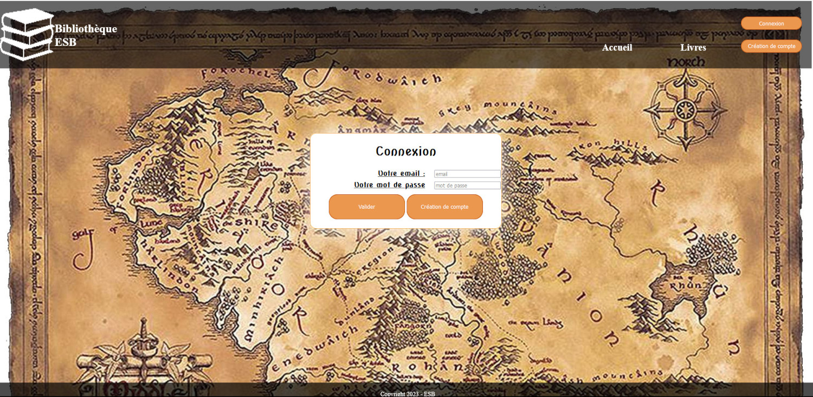
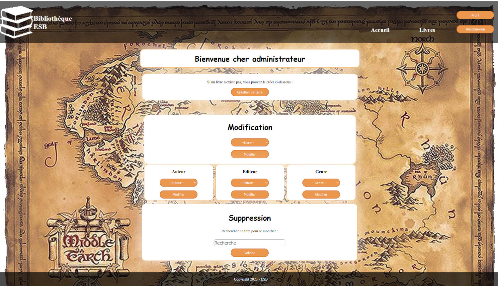
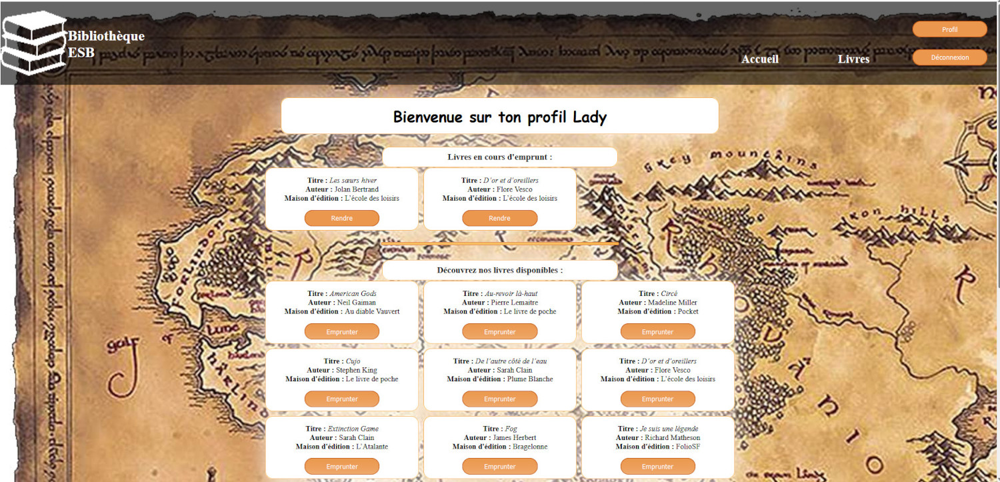

# Site d'emprunt : Bibliothèque

C'est le premier projet que nous avons dû réaliser en Remise A Niveau.
Nous devions réalisé le projet à trois, mais j'ai quasiment tout fait seule.

## Apprentissage
Nous n'avions pas fait de front et peu de PHP. 
Je m'étais formée en autodidacte en HTML et CSS avant la formation, j'ai donc pu me consacrer à l'apprentissage du PHP.

## Langages utilisés
- HTML
- CSS
- MySQL
- PHP procédural

## Contraintes
- connexion et déconnexion
- profil utilisateur avec l'affichage des livres disponibles
- possibilité d'emprunter les livres et de les rendre
- partie administrateur : créer de nouveaux livres, les modifier, les supprimer

## Délais
Nous avons eu une dizaine de jours pour réaliser le projet.

<h2 style="text-align: center">Images du projet</h2>

<h4 style="text-align: center">Acceuil du site</h4>

<h4 style="text-align: center">Partie administrateur</h4>

<h4 style="text-align: center">Profil utilisateur</h4>
